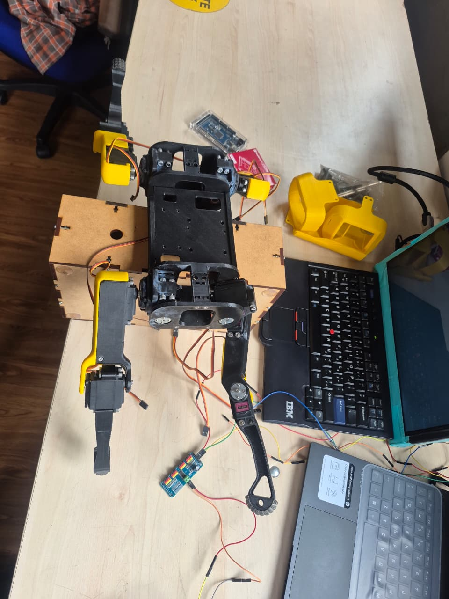

# Proyecto II — Evidencias del 24 de agosto de 2026

## Punto de partida

## Video de avances

[Ver el video completo en YouTube](https://youtube.com/shorts/rLzRbPp0ZOo)

## Contenido

- `Puntodepartida.jpeg`: estado físico del robot al comenzar esta etapa.
- `INFORME_AVANCES_24_08_2026.pdf`: descripción breve del trabajo realizado.
- Los dos videos originales de la sesión, conservados como evidencia.
