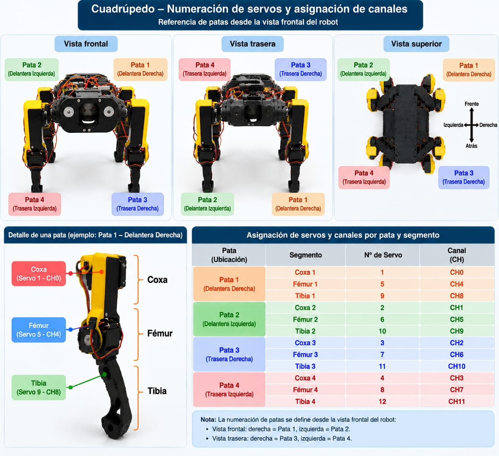

# Conexiones Raspberry Pi 4, PCA9685 y MG996R

## Raspberry Pi 4 hacia PCA9685

| Raspberry (pin físico) | Señal BCM | PCA9685 | Función |
|---:|---|---|---|
| 1 | 3V3 | VCC | Alimentación lógica de 3,3 V |
| 3 | GPIO2 / SDA1 | SDA | Datos I2C |
| 5 | GPIO3 / SCL1 | SCL | Reloj I2C |
| 6 | GND | GND | Tierra lógica común |
| 11 | GPIO17 | OE | HIGH apaga; LOW habilita PWM |

En la placa fotografiada (V1.2.4.6), el header superior se lee de izquierda a
derecha: `V+`, `VCC`, `SDA`, `SCL`, `OE`, `GND`. El header inferior está
invertido: `GND`, `OE`, `SCL`, `SDA`, `VCC`, `V+`. Usar siempre la serigrafía;
la orientación física puede cambiar al girar la placa.

Se recomienda una resistencia pull-up externa de 10 kΩ entre `OE` y 3,3 V para
que las salidas permanezcan deshabilitadas durante el arranque.

## Alimentación de servos

- Fuente externa regulada de 5--6 V: positivo a `V+` del PCA9685.
- Negativo de la fuente: `GND` del PCA9685 y tierra común con Raspberry.
- No conectar `V+` al pin de 5 V de la Raspberry.
- No alimentar los servos desde `VCC`; `VCC` es solo lógica.
- Añadir fusible, parada física y cableado dimensionado después de medir
  corriente real de un MG996R asegurado.

## Conector de cada servo

- Marrón o negro: GND.
- Rojo: V+ externo de 5--6 V.
- Naranja, amarillo o blanco: señal PWM del canal.

Confirma los colores del fabricante antes de energizar.

## Canales propuestos

Estos son puertos del **PCA9685**, no pines físicos de la Raspberry. La
Raspberry envía por I2C las órdenes calculadas por el mismo generador de marcha
empleado en Gazebo; el PCA9685 produce las doce señales PWM.

## Dos TCA9548A y doce AS5600: retroalimentación articular

Los multiplexores y el PCA9685 comparten **el mismo bus I2C-1**, no requieren
un par de pines de señal adicional por cada TCA. Con la Raspberry apagada y la
potencia de servos desconectada, el cableado de lógica debe ser:

| Raspberry Pi 4 (pin físico) | Señal | Conectar a ambos TCA9548A |
|---:|---|---|
| 1 o 17 | 3V3 | `VIN`/`VCC` de lógica, solo si el módulo acepta 3,3 V |
| 3 | GPIO2 / SDA1 | `SDA` |
| 5 | GPIO3 / SCL1 | `SCL` |
| 6 (u otro GND) | GND | `GND` |

Los cables `SDA` y `SCL` se ramifican en paralelo hacia PCA9685, TCA `0x70` y
TCA `0x71`; todos comparten GND. No aplicar 5 V directamente a `SDA` o `SCL`
de la Raspberry: son señales lógicas de 3,3 V. Confirmar antes la serigrafía y
las resistencias pull-up de cada breakout; algunos módulos comerciales unen
los pull-up a su pin `VIN`.

Cada AS5600 se conecta únicamente detrás de un canal del TCA: `VCC` a la
alimentación lógica compatible del módulo, `GND` común, y `SDA`/`SCL` al canal
seleccionado. Los canales de cada TCA aíslan los AS5600, que todos usan la
dirección fija `0x36`.

El lector de diagnóstico `codigo/leer_as5600_tca.py` no genera PWM ni modifica
`OE`. Lee los doce canales descritos por el sketch Arduino y conserva como
pendiente `0x71`, canal 3: el sketch proporcionado duplica «fémur 2» y no
identifica «coxa 2», por lo que esa asociación debe confirmarse físicamente
antes de publicar posiciones articulares.

| Canal | Articulación | Canal | Articulación |
|---:|---|---:|---|
| 0 | FR coxa | 6 | RR fémur |
| 1 | FL coxa | 7 | RL fémur |
| 2 | RR coxa | 8 | FR tibia |
| 3 | RL coxa | 9 | FL tibia |
| 4 | FR fémur | 10 | RR tibia |
| 5 | FL fémur | 11 | RL tibia |

FL: delantera izquierda; FR: delantera derecha; RL: trasera izquierda; RR:
trasera derecha. Los canales 12--15 quedan libres.

## Evidencia visual de la asignación física

La imagen siguiente registra la numeración de las patas desde la vista frontal,
la correspondencia entre coxa, fémur y tibia, y la asignación de los doce
servos a los canales del PCA9685:

La convención queda fijada así: Pata 1 es delantera derecha, Pata 2 delantera
izquierda, Pata 3 trasera derecha y Pata 4 trasera izquierda. La imagen es una
referencia de cableado y numeración; no sustituye la calibración individual ni
la verificación de seguridad eléctrica.
