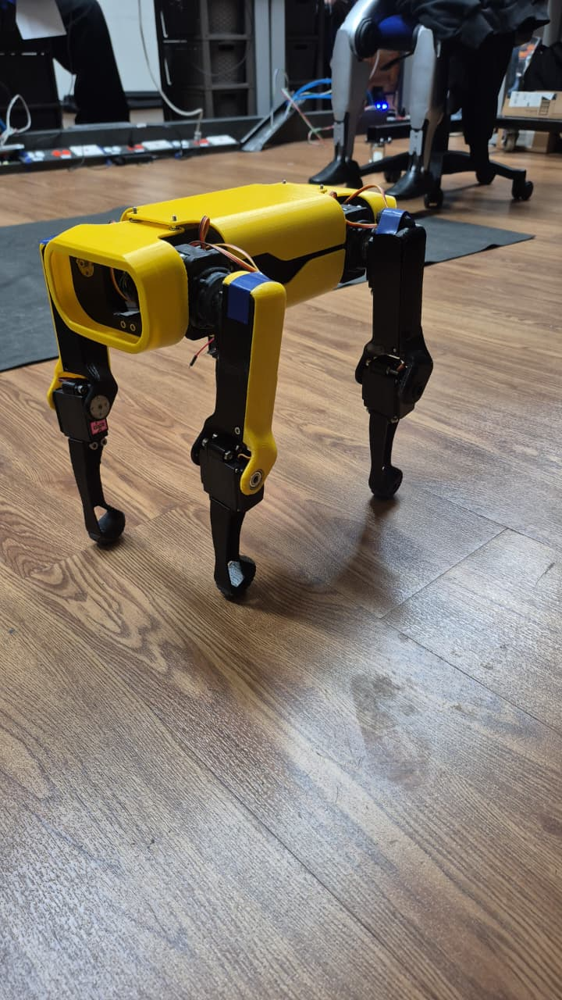
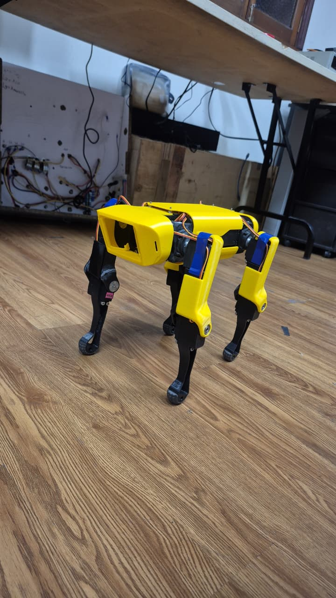

# Evidencia fotográfica del cuadrúpedo real — 3 de septiembre de 2026

Estas fotografías documentan el prototipo físico Nova SM3 en una superficie de
madera, con sus cuatro patas instaladas y el cuerpo amarillo/negro visible.
También se observan los actuadores, los segmentos de coxa/fémur/tibia y parte
del cableado de la electrónica.

## Vistas

### Vista 1

### Vista 2

## Alcance de la evidencia

Las imágenes sirven para documentar la geometría externa y el estado visual del
prototipo. No permiten verificar por sí solas el canal PCA9685 de cada servo,
la polaridad, la tensión de alimentación, la masa, la calibración ni el estado
del pin OE. Esos datos deben conservarse en las tablas y mediciones eléctricas
correspondientes.
